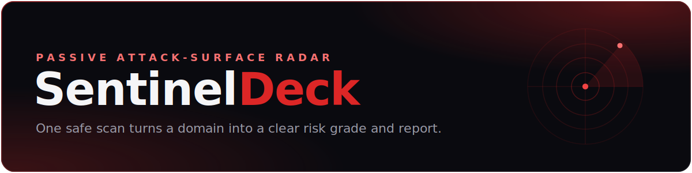

<div align="center">



<p>
  <strong>Passive attack-surface radar for small businesses, agencies, and security consultants.</strong><br>
  One safe scan turns a domain into a clear risk grade, structured JSON, and a client-ready report.
</p>

</div>

<table>
  <tr>
    <td><b>Testing</b></td>
    <td>
      <a href="https://github.com/sanmaxdev/SentinelDeck/actions/workflows/ci.yml"></a>
    </td>
  </tr>
  <tr>
    <td><b>Code quality</b></td>
    <td>
      <a href="https://github.com/sanmaxdev/SentinelDeck/actions/workflows/security.yml"></a>
      <a href="https://github.com/sanmaxdev/SentinelDeck/blob/main/.pre-commit-config.yaml"></a>
    </td>
  </tr>
  <tr>
    <td><b>Code style</b></td>
    <td>
      <a href="https://github.com/astral-sh/ruff"></a>
      
    </td>
  </tr>
  <tr>
    <td><b>Package</b></td>
    <td>
      <a href="https://pypi.org/project/sentineldeck/"></a>
      
      
      
      <a href="LICENSE"></a>
    </td>
  </tr>
  <tr>
    <td><b>Safety</b></td>
    <td>
      
      <a href="SECURITY.md"></a>
    </td>
  </tr>
</table>

SentinelDeck inspects the public-facing posture of a domain across DNS, HTTP,
TLS, email authentication, and its certificate-transparency footprint, using
only the kind of normal lookups any browser or mail server would make. There is
no intrusive scanning, no exploitation, and nothing a domain owner would not
expect. The result is a risk score, an A to F grade, and a set of prioritised
findings, each with a concrete copy-paste fix.

It is built for the people who need that picture fast: an agency qualifying a
prospect, a consultant producing a client report, or a small team checking its
own footprint.

## Contents

- [Features](#features)
- [What it checks](#what-it-checks)
- [Installation](#installation)
- [Usage](#usage)
- [Example output](#example-output)
- [How it works](#how-it-works)
- [Development](#development)
- [Safety model](#safety-model)
- [Support](#support)
- [License](#license)

## Features

<table>
  <tr>
    <td width="50%" valign="top">
      <h3>Passive and safe by design</h3>
      Only standard DNS, HTTP, TLS, and email lookups, the same requests any
      browser or mail server makes. Run it against any domain you are authorised
      to assess.
    </td>
    <td width="50%" valign="top">
      <h3>Accurate, with a confidence model</h3>
      DNS is resolved in-process and certificates are parsed directly. Any check
      that cannot be confirmed is marked unverified and kept out of the score, so
      a client never sees a guess presented as fact.
    </td>
  </tr>
  <tr>
    <td width="50%" valign="top">
      <h3>Five surfaces in one pass</h3>
      DNS hygiene, HTTP security headers, TLS certificate quality, email
      authentication, and domain registration intelligence, scored together into
      a single picture.
    </td>
    <td width="50%" valign="top">
      <h3>Clear risk score and grade</h3>
      Every finding is weighted by severity into a 0 to 100 risk score and an A to
      F grade, each paired with a prioritised, plain-language remediation step.
    </td>
  </tr>
  <tr>
    <td width="50%" valign="top">
      <h3>Copy-paste remediation</h3>
      Every finding ships the exact fix, not just advice: the precise DNS record,
      HTTP header, or server config that resolves it, each with an authoritative
      reference. Carried in both the JSON and the HTML report.
    </td>
    <td width="50%" valign="top">
      <h3>Interactive remediation simulator</h3>
      The HTML report lets a client tick off the fixes they plan to make and
      watch the projected score and grade climb live, with one-click "quick wins"
      that picks the shortest path to grade A.
    </td>
  </tr>
  <tr>
    <td width="50%" valign="top">
      <h3>Attack-surface mapping</h3>
      Reads certificate transparency logs to discover the domain's public
      subdomains, flags potentially sensitive names (dev, staging, admin, vpn),
      and detects dangling CNAMEs an attacker could take over.
    </td>
    <td width="50%" valign="top">
      <h3>Monitoring and alerts</h3>
      Diff any two scans, or run the monitor command on a schedule to scan,
      compare against the last run, and post a webhook alert (Slack, Discord, or
      custom) the moment a domain's posture regresses.
    </td>
  </tr>
  <tr>
    <td width="50%" valign="top">
      <h3>Report-ready outputs</h3>
      Structured JSON for automation, a polished dark and red HTML report for
      clients, a shareable score card, an embeddable grade badge, and an HTML
      change report.
    </td>
    <td width="50%" valign="top">
      <h3>Resilient by design</h3>
      Two certificate-transparency sources (crt.sh with a CertSpotter fallback)
      and a DNS-over-HTTPS fallback for blocked networks, so a scan keeps working
      where a naive tool would silently fail.
    </td>
  </tr>
</table>

## What it checks

| Area | Checks |
| --- | --- |
| **DNS** | Resolution, CAA issuance control, DNSSEC |
| **HTTP** | HTTPS reachability, HTTP to HTTPS redirect, security-header presence **and** value quality, security.txt, cookie flags, version disclosure |
| **TLS** | Trust and failure reason (expired, self-signed, hostname mismatch, untrusted), expiry, protocol version, key strength, signature algorithm, hostname match |
| **Email** | MX, SPF (policy, multiple records, 10-lookup limit), DMARC (policy, subdomain policy, enforcement coverage), DKIM, MTA-STS, TLS-RPT, BIMI |
| **Domain** | Registrar, registration age, and expiry via RDAP |
| **Subdomains** | Public subdomain discovery via certificate transparency (crt.sh, CertSpotter), sensitive-name flagging, and dangling-CNAME takeover detection |

Every issue is scored by severity into a 0 to 100 risk score and an A to F grade.

## Installation

SentinelDeck requires **Python 3.10 or newer**.

From PyPI (available once the first release is published, see
[RELEASING.md](RELEASING.md)):

```bash
pip install sentineldeck
```

From source:

```bash
git clone https://github.com/sanmaxdev/SentinelDeck.git
cd SentinelDeck
python3 -m venv .venv
. .venv/bin/activate            # Windows: .venv\Scripts\activate
pip install -e .
```

Either way, this puts the `sentineldeck` command on your path. To verify:

```bash
sentineldeck --version
```

For development, install the dev extras (pytest and ruff):

```bash
pip install -e ".[dev]"
```

## Usage

Scan a domain and write a JSON report:

```bash
sentineldeck scan example.com --output reports/example.json
```

Accept findings you have already reviewed so they stop affecting the score, by
listing their ids in a suppressions file:

```bash
sentineldeck scan example.com --suppress .sentineldeck-ignore
```

Each line is a finding id (globs allowed, e.g. `subdomain-takeover:*`), and `#`
starts a comment. Accepted findings still appear under "Accepted" in the report
but are kept out of the risk score, so a known and accepted risk does not drag
the grade down on every re-scan.

Render a client-ready HTML report, a shareable score card, and a badge. The HTML
report includes the attack-surface map and the interactive remediation
simulator:

```bash
sentineldeck report reports/example.json \
  --html reports/example.html \
  --svg  reports/example-card.svg \
  --badge reports/example-badge.svg
```

Track how a domain's posture changes between two scans:

```bash
sentineldeck diff reports/example-may.json reports/example-june.json \
  --html reports/example-change.html
```

The `diff` command shows what is new, what was resolved, score and grade
movement, and any severity escalations. It exits non-zero with `--exit-code`
when the posture regresses (a new high or critical finding, or a higher score),
so it drops straight into a cron job or CI step for scheduled monitoring.

Watch a domain on a schedule and get alerted when it regresses:

```bash
sentineldeck monitor example.com --webhook https://hooks.slack.com/services/...
```

The `monitor` command scans, compares against the previous run (stored under
`.sentineldeck/` by default), and saves the new report as the latest, so a cron
job or scheduled task becomes a standing watch. With `--webhook` it posts an
alert (Slack, Discord, or any custom endpoint) when the posture regresses. The
first run establishes a baseline; use `--alert-on change` to hear about any
change, and `--exit-code` to fail a job on regression.

Useful flags: `--pretty` prints the full JSON to stdout, `--timeout` bounds the
HTTP and TLS probes, and `diff --json` or `diff -o` emit the structured delta.

## Example output

```json
{
  "target": "example.com",
  "risk_score": 27,
  "grade": "B",
  "findings": [
    { "id": "dmarc-missing", "severity": "medium", "confidence": "confirmed", "...": "..." }
  ]
}
```

## How it works

```
src/sentineldeck/
├── scanner.py          # runs every probe concurrently and assembles the report
├── scanners/           # one module per surface: dns, dns_hygiene, tls, http_headers,
│                       #   email_security, domain_intel, subdomains, takeover
├── risk/scoring.py     # turns raw check results into scored findings
├── remediation.py      # maps each finding to a concrete copy-paste fix
├── diff.py             # compares two reports into a structured change delta
├── monitor.py          # scan, compare to the last run, and persist state
├── alerts.py           # webhook delivery on regression
├── reporters/          # json, html, svg (card + badge), and diff renderers
└── models.py           # Finding and ScanReport data models
```

Each scanner is independent and keeps its network call injectable, so the whole
suite is tested offline with mocked DNS, HTTP, and certificate-transparency data.

## Development

```bash
pip install -e ".[dev]"
ruff check .
pytest -q
```

Optionally enable the pre-commit hooks so linting runs on every commit:

```bash
pip install pre-commit && pre-commit install
```

CI runs ruff and the full test suite on Python 3.10, 3.11, and 3.12, and CodeQL
scans the codebase for security issues on every push.

## Safety model

SentinelDeck is **passive-first**. It performs only normal DNS lookups and
standard HTTP and TLS metadata requests against the supplied domain, plus public
certificate-transparency queries. It does not probe, fuzz, or exploit anything.
Use it only on domains you own or are authorised to assess.

## Support

- **Questions and bug reports**: open an issue on the
  [issue tracker](https://github.com/sanmaxdev/SentinelDeck/issues).
- **Security issues**: please follow the [security policy](SECURITY.md) instead
  of filing a public issue.
- **Contributing**: see [CONTRIBUTING.md](CONTRIBUTING.md). New checks must be
  passive-safe and come with tests. This project follows a
  [Code of Conduct](CODE_OF_CONDUCT.md).

## License

[MIT](LICENSE)
